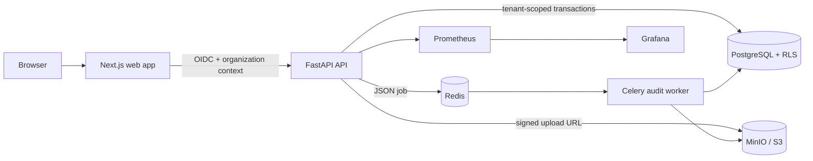
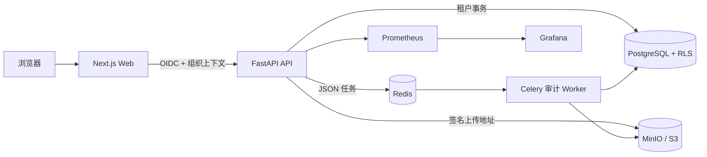
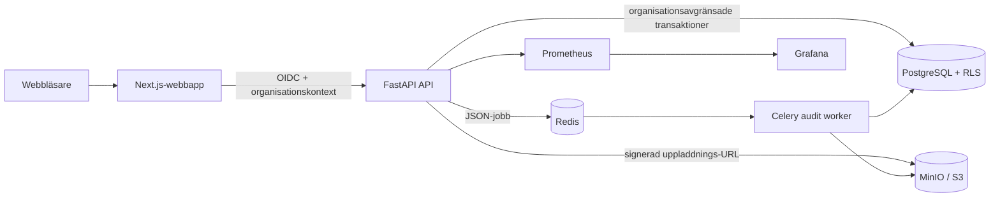

<a id="top"></a>

# FairHire AI

**Recruitment AI assurance, governance, and evidence workspace**

[](https://github.com/AringaRosa9/FairHire-AI/actions/workflows/ci.yml)


**Language / 语言 / Språk:** [English](#english) · [中文](#中文) · [Svenska](#svenska)

---

<a id="english"></a>

## English

### Overview

FairHire AI helps organizations evaluate, govern, and document AI used in recruitment. It brings system registration, dataset intake, reproducible fairness audits, findings, remediation, approvals, and immutable evidence packages into one multi-tenant workspace.

The project is designed around **evidence over scores**: it records what was tested, against which policy and threshold, with which data and model version, what uncertainty remains, who approved the outcome, and whether the release gate is satisfied.

> [!IMPORTANT]
> FairHire AI provides technical assessment and governance workflows. It does not make hiring decisions, issue regulatory certification, or replace advice from Legal, DPO, Responsible AI, HR, or other accountable reviewers.

### Key capabilities

- Register recruitment AI systems, versions, intended use, affected groups, jurisdictions, and organizational roles.
- Ingest CSV, Parquet, and JSONL evidence through short-lived, checksum-bound S3-compatible signed URLs.
- Validate schema, provenance, field mappings, malware-scan attestations, and privacy-sensitive attributes before analysis.
- Run deterministic data-quality and binary-classification audits for missingness, duplicates, outliers, leakage, coverage, selection rates, demographic parity, TPR/FPR, equal opportunity/equalized odds, precision, calibration, and error rates.
- Report raw counts, uncertainty intervals, threshold provenance, privacy-floor suppression, and explicit `insufficient_evidence` outcomes.
- Analyze proxy risk, counterfactual consistency, explainability, model comparison, and drift.
- Manage findings, owners, deadlines, remediation tasks, retests, time-limited risk acceptances, and sequential Responsible AI → HR → Legal/DPO approvals.
- Block release for unresolved Critical findings, insufficient evidence, outdated rule packs, or expired policies.
- Freeze versioned evidence packages with traceable PDF, JSON, and CSV exports plus SHA-256 content hashes.
- Provide a read-only compliance assistant that distinguishes facts, inferences, and recommendations; cites substantive claims; filters evidence by tenant and role; and records every answer.
- Protect tenant data with PostgreSQL forced row-level security, role checks, organization-scoped object keys, and an append-only hash-chained audit ledger.
- Ship with known-bias benchmarks, a one-million-row load harness, browser/accessibility regression coverage, supply-chain checks, SBOM generation, readiness probes, Prometheus alerts, and a Grafana pilot dashboard.

### Architecture



The API owns authorization and transactional records. The isolated worker receives immutable artifact references and never trusts tenant identity from uploaded content. See [Architecture and data model](docs/architecture.md) for trust boundaries, invariants, and the ERD.

### Technology stack

| Layer | Technology |
|---|---|
| Web | Next.js, React, TypeScript |
| API | FastAPI, Pydantic, SQLAlchemy, Alembic |
| Audit domain | Python 3.12, deterministic statistical analysis |
| Jobs | Celery, Redis |
| Data | PostgreSQL 17 with forced RLS; MinIO/S3-compatible object storage |
| Contracts | OpenAPI, generated TypeScript API client, versioned JSON Schema |
| Quality | Vitest, Playwright, pytest, Ruff, mypy, axe |
| Operations | Docker Compose, GitHub Actions, Prometheus, Grafana, CycloneDX SBOM |

### Repository layout

```text
apps/
  api/                 FastAPI service, migrations, and API tests
  web/                 Next.js workspace and browser tests
  worker/              Isolated Celery audit worker
python/fairhire_domain/ Reusable audit and governance domain logic
packages/
  api-client/          Generated TypeScript contract client
  policy-schemas/      Versioned audit policy schemas
  ui/                  Shared UI components and design tokens
contracts/             Checked-in OpenAPI contract
docs/                  Architecture, security, governance, and operations
infra/                 PostgreSQL and observability configuration
scripts/               Pilot import, verification, and SBOM tooling
tests/                 Contract, integration, security, and load tests
```

### Quick start

Prerequisites: Docker Desktop, Node.js 22+, npm 11+, and Git.

```bash
git clone https://github.com/AringaRosa9/FairHire-AI.git
cd FairHire-AI
cp .env.example .env
npm install
docker compose up --build
```

Open the web app at [http://localhost:3000](http://localhost:3000), API docs at [http://localhost:8000/docs](http://localhost:8000/docs), and the MinIO console at [http://localhost:9101](http://localhost:9101).

Default host ports are `3000` (web), `8000` (API), `55432` (PostgreSQL), `56379` (Redis), `9100` (S3 API), and `9101` (MinIO console). Start observability with:

```bash
docker compose --profile observability up --build
```

Prometheus then runs on `9090` and Grafana on `3001`.

### Configuration and security

- Copy `.env.example` to `.env`; never commit real secrets or candidate data.
- `X-Dev-User` and `X-Organization-ID` are accepted only when `DEV_AUTH_ENABLED=true`. Production configuration rejects development authentication.
- Migrations use `MIGRATION_DATABASE_URL`; the application uses the non-superuser account in `DATABASE_URL` so forced PostgreSQL RLS remains effective.
- Uploads bypass the API process and require a short-lived signed URL. Production upload completion also requires an HMAC scanner attestation through `SCANNER_ATTESTATION_SECRET`.
- Replace every example password and secret before any shared or production deployment.
- Review the [threat model](docs/threat-model.md), [RBAC matrix](docs/rbac.md), [retention policy](docs/retention.md), and [pilot runbook](docs/pilot-runbook.md) before deployment.

### Development and verification

```bash
npm run lint
npm run typecheck
npm test
npm run build
docker compose run --rm api pytest
npm run test:e2e
```

Run the full Week 14 release suite; browser and load checks are explicitly opt-in because they are slower:

```bash
npm run verify:week14
FAIRHIRE_RUN_E2E=1 FAIRHIRE_RUN_LOAD_TEST=1 npm run verify:week14
```

After changing the API, regenerate and check in the OpenAPI contract and TypeScript client:

```bash
make contract
```

See [release readiness](docs/release-readiness.md) for technical gates, mandatory stop conditions, and human approvals required for a pilot release.

### Documentation

| Topic | Document |
|---|---|
| Product scope and non-goals | [PRD](PRD.md) |
| Delivery milestones | [Development plan](DEVELOPMENT_PLAN.md) |
| Architecture and ERD | [Architecture](docs/architecture.md) |
| API behavior | [API conventions](docs/api-conventions.md) |
| Data and audit schema | [Data contract](docs/data-contract.md) |
| Roles and tenant access | [RBAC](docs/rbac.md) |
| Security boundaries | [Threat model](docs/threat-model.md) |
| Governance workflow | [Governance loop](docs/governance-loop.md) |
| Evidence and assistant safeguards | [Evidence assistant](docs/evidence-assistant.md) |
| Release evidence | [Release readiness](docs/release-readiness.md) |
| Deployment and incidents | [Pilot runbook](docs/pilot-runbook.md) |

### Project status and roadmap

The repository currently contains the Week 14 pilot-ready technical baseline. Automated checks provide engineering evidence, but named owners must still complete the manual accessibility, backup/restore, security, Responsible AI, and Legal/DPO approvals documented in the release gate.

Planned directions include ATS/MLOps connectors, controlled black-box inference testing, additional model types, DPIA/FRIA workflows, enterprise identity provisioning, multi-jurisdiction rule packs, continuous production monitoring, and GRC integrations. Roadmap items are proposals, not commitments.

### Contributing

Issues and focused pull requests are welcome. Before opening a PR:

1. Describe the user, governance, or security problem and keep the change narrowly scoped.
2. Add or update tests and documentation for behavior changes.
3. Run linting, type checks, unit tests, builds, and relevant integration/browser tests.
4. Regenerate contract artifacts when the API schema changes.
5. Do not include personal data, customer evidence, credentials, or generated secrets.

For security-sensitive reports, use GitHub's private security reporting channel when enabled; do not disclose exploitable details in a public issue.

### License

No open-source license has been granted yet. Unless a license file is added, the source remains **all rights reserved** and may not be copied, redistributed, or used beyond permissions granted by the copyright holder.

[Back to top](#top)

---

<a id="中文"></a>

## 中文

### 项目简介

FairHire AI 是面向招聘 AI 的技术评估、治理与证据管理平台。它把 AI 系统登记、数据接入、可复现的公平性审计、问题整改、多角色审批和不可篡改的证据包整合在一个多租户工作区中。

项目坚持“**证据优先，而非单一评分**”：完整记录测试对象、适用规则和阈值、数据与模型版本、统计不确定性、审批责任人，以及系统是否满足发布门禁。

> [!IMPORTANT]
> FairHire AI 提供技术评估和治理工作流，不参与候选人录用决策，不颁发监管认证，也不能替代法务、DPO、Responsible AI、HR 或其他责任人的专业判断。

### 核心能力

- 登记招聘 AI 系统、版本、预期用途、受影响群体、适用地区和组织角色。
- 通过短时有效、绑定校验和的 S3 兼容签名 URL 接入 CSV、Parquet 和 JSONL 证据。
- 在分析前校验数据结构、来源、字段映射、恶意文件扫描证明和隐私敏感属性。
- 执行确定性的数据质量与二分类审计，包括缺失、重复、异常值、泄漏、覆盖度、选择率、人口统计均等、TPR/FPR、机会均等/均等化赔率、精确率、校准度和错误率。
- 同时呈现原始计数、置信区间、阈值来源、隐私最小样本抑制，以及明确的 `insufficient_evidence`（证据不足）结论。
- 支持代理变量风险、成对反事实一致性、可解释性、模型对比和漂移分析。
- 管理问题、责任人、截止日期、整改任务、复测、限时风险接受，以及 Responsible AI → HR → 法务/DPO 的顺序审批。
- 对未解决的 Critical 问题、证据不足、过期规则包或过期政策阻止发布。
- 冻结版本化证据包，导出可追溯的 PDF、JSON、CSV，并记录 SHA-256 内容哈希。
- 提供只读合规助手：区分事实、推断和建议，为实质性结论标注来源，按租户和角色过滤证据，并记录每次回答。
- 通过 PostgreSQL 强制行级安全、角色校验、组织隔离的对象键和哈希链审计日志保护租户数据。
- 内置已知偏差基准、百万行负载测试、浏览器与无障碍回归、供应链检查、SBOM、就绪探针、Prometheus 告警和 Grafana 试点看板。

### 系统架构



API 负责授权与事务记录；隔离的 Worker 只接收不可变的制品引用，不信任上传内容中的租户身份。完整信任边界、数据不变量和 ERD 请查看[架构与数据模型](docs/architecture.md)。

### 技术栈

| 层级 | 技术 |
|---|---|
| Web | Next.js、React、TypeScript |
| API | FastAPI、Pydantic、SQLAlchemy、Alembic |
| 审计领域 | Python 3.12、确定性统计分析 |
| 异步任务 | Celery、Redis |
| 数据 | PostgreSQL 17 强制 RLS、MinIO/S3 兼容对象存储 |
| 契约 | OpenAPI、生成式 TypeScript 客户端、版本化 JSON Schema |
| 质量 | Vitest、Playwright、pytest、Ruff、mypy、axe |
| 运维 | Docker Compose、GitHub Actions、Prometheus、Grafana、CycloneDX SBOM |

### 仓库结构

```text
apps/api/                FastAPI 服务、迁移与 API 测试
apps/web/                Next.js 工作区与浏览器测试
apps/worker/             隔离的 Celery 审计 Worker
python/fairhire_domain/  可复用的审计与治理领域逻辑
packages/                API 客户端、策略 Schema 与共享 UI
contracts/               纳入版本控制的 OpenAPI 契约
docs/                    架构、安全、治理与运维文档
infra/                   PostgreSQL 与可观测性配置
scripts/                 试点导入、验证与 SBOM 工具
tests/                   契约、集成、安全与负载测试
```

### 快速开始

环境要求：Docker Desktop、Node.js 22+、npm 11+ 和 Git。

```bash
git clone https://github.com/AringaRosa9/FairHire-AI.git
cd FairHire-AI
cp .env.example .env
npm install
docker compose up --build
```

Web 页面：[http://localhost:3000](http://localhost:3000)；API 文档：[http://localhost:8000/docs](http://localhost:8000/docs)；MinIO 控制台：[http://localhost:9101](http://localhost:9101)。默认宿主机端口还包括 PostgreSQL `55432`、Redis `56379` 和 S3 API `9100`。

启动 Prometheus（`9090`）和 Grafana（`3001`）：

```bash
docker compose --profile observability up --build
```

### 配置与安全

- 将 `.env.example` 复制为 `.env`，不要提交真实密钥或候选人数据。
- 仅当 `DEV_AUTH_ENABLED=true` 时才接受 `X-Dev-User` 和 `X-Organization-ID`；生产配置会拒绝开发认证。
- 数据库迁移使用 `MIGRATION_DATABASE_URL`；应用使用 `DATABASE_URL` 中的非超级用户，以确保 PostgreSQL 强制 RLS 生效。
- 上传数据不经过 API 进程，而是使用短时签名 URL；生产环境还必须通过 `SCANNER_ATTESTATION_SECRET` 提交 HMAC 扫描证明。
- 在共享或生产环境部署前，必须替换所有示例密码和密钥。
- 部署前请审阅[威胁模型](docs/threat-model.md)、[RBAC 矩阵](docs/rbac.md)、[保留策略](docs/retention.md)和[试点运维手册](docs/pilot-runbook.md)。

### 开发与验证

```bash
npm run lint
npm run typecheck
npm test
npm run build
docker compose run --rm api pytest
npm run test:e2e
```

运行 Week 14 发布验证；浏览器与负载测试耗时较长，因此需要显式开启：

```bash
npm run verify:week14
FAIRHIRE_RUN_E2E=1 FAIRHIRE_RUN_LOAD_TEST=1 npm run verify:week14
```

API 发生变化后，重新生成并提交 OpenAPI 契约与 TypeScript 客户端：

```bash
make contract
```

技术门禁、强制停止条件和试点发布所需的人工签署见[发布就绪文档](docs/release-readiness.md)。

### 文档导航

| 主题 | 文档 |
|---|---|
| 产品范围与非目标 | [产品需求文档](PRD.md) |
| 交付里程碑 | [开发计划](DEVELOPMENT_PLAN.md) |
| 架构与 ERD | [架构文档](docs/architecture.md) |
| API 行为 | [API 规范](docs/api-conventions.md) |
| 数据与审计结构 | [数据契约](docs/data-contract.md) |
| 角色与租户访问 | [RBAC](docs/rbac.md) |
| 安全边界 | [威胁模型](docs/threat-model.md) |
| 治理工作流 | [治理闭环](docs/governance-loop.md) |
| 证据与助手防护 | [证据助手](docs/evidence-assistant.md) |
| 发布证据 | [发布就绪](docs/release-readiness.md) |
| 部署与事件响应 | [试点运维手册](docs/pilot-runbook.md) |

### 项目状态与路线图

仓库当前包含 Week 14 的 pilot-ready 技术基线。自动化检查能够形成工程证据，但无障碍、备份恢复、安全、Responsible AI 和法务/DPO 等责任人仍需按照发布门禁完成人工验收。

后续方向包括 ATS/MLOps 连接器、受控黑盒推理测试、更多模型类型、DPIA/FRIA 工作流、企业身份管理、多司法辖区规则包、生产持续监控和 GRC 集成。路线图仅表示规划方向，不构成承诺。

### 参与贡献

欢迎提交 Issue 和范围明确的 Pull Request。提交 PR 前请：

1. 说明要解决的用户、治理或安全问题，并控制改动范围。
2. 为行为变化补充或更新测试与文档。
3. 运行 lint、类型检查、单元测试、构建及相关集成/浏览器测试。
4. API Schema 变化时重新生成契约制品。
5. 不得提交个人数据、客户证据、凭据或生成的密钥。

安全漏洞请优先使用 GitHub 私密安全报告渠道（启用后），不要在公开 Issue 中披露可利用细节。

### 许可证

本项目当前尚未授予开源许可证。在仓库加入明确的许可证文件之前，源代码为**保留所有权利**，未经版权所有者许可不得复制、再分发或使用。

[返回顶部](#top)

---

<a id="svenska"></a>

## Svenska

### Översikt

FairHire AI är en plattform för teknisk granskning, styrning och evidenshantering av AI som används vid rekrytering. Plattformen samlar systemregistrering, datainläsning, reproducerbara rättvisegranskningar, avvikelser, åtgärder, godkännanden och oföränderliga evidenspaket i en arbetsyta med stöd för flera organisationer.

Projektet bygger på principen **evidens framför poäng**: det dokumenterar vad som testades, mot vilken policy och vilket tröskelvärde, med vilken data- och modellversion, vilken osäkerhet som återstår, vem som godkände resultatet och om lanseringsgrinden är uppfylld.

> [!IMPORTANT]
> FairHire AI erbjuder teknisk utvärdering och arbetsflöden för styrning. Plattformen fattar inga anställningsbeslut, utfärdar ingen regulatorisk certifiering och ersätter inte bedömningar från jurist, dataskyddsombud, Responsible AI, HR eller andra ansvariga granskare.

### Viktiga funktioner

- Registrera rekryteringssystem, versioner, avsett ändamål, berörda grupper, jurisdiktioner och organisatoriska roller.
- Läs in CSV-, Parquet- och JSONL-underlag via kortlivade, kontrollsummeknutna och S3-kompatibla signerade URL:er.
- Validera schema, ursprung, fältmappning, skanningsintyg och integritetskänsliga attribut före analys.
- Kör deterministiska kvalitets- och binärklassificeringsgranskningar för bland annat saknade värden, dubbletter, avvikare, dataläckage, täckning, urvalsgrad, demografisk paritet, TPR/FPR, equal opportunity/equalized odds, precision, kalibrering och felfrekvens.
- Visa råa antal, osäkerhetsintervall, tröskelvärdenas ursprung, sekretessbaserad undertryckning och tydliga resultat av typen `insufficient_evidence`.
- Analysera proxyrisk, kontrafaktisk konsekvens, förklarbarhet, modelljämförelser och drift.
- Hantera avvikelser, ansvariga, tidsfrister, åtgärder, omtester, tidsbegränsade riskacceptanser och sekventiella godkännanden från Responsible AI → HR → juridik/dataskyddsombud.
- Blockera lansering vid olösta kritiska avvikelser, otillräcklig evidens, inaktuella regelpaket eller utgångna policyer.
- Frys versionshanterade evidenspaket med spårbara PDF-, JSON- och CSV-exporter samt SHA-256-hashar.
- Använd en skrivskyddad compliance-assistent som skiljer fakta, slutsatser och rekommendationer åt, anger källor, filtrerar evidens efter organisation och roll samt loggar varje svar.
- Skydda organisationsdata med tvingande radnivåsäkerhet i PostgreSQL, rollkontroller, organisationsavgränsade objektnycklar och en append-only-revisionslogg med hashkedja.
- Använd inbyggda bias-riktmärken, belastningstest med en miljon rader, webbläsar- och tillgänglighetsregressioner, leveranskedjekontroller, SBOM, readiness-prober, Prometheus-larm och en Grafana-panel för pilotdrift.

### Arkitektur



API:t ansvarar för behörighet och transaktionsdata. Den isolerade workern tar emot oföränderliga artefaktreferenser och litar aldrig på organisationsidentitet i uppladdat innehåll. Se [arkitektur och datamodell](docs/architecture.md) för tillitsgränser, invariants och ERD.

### Teknikstack

| Lager | Teknik |
|---|---|
| Webb | Next.js, React, TypeScript |
| API | FastAPI, Pydantic, SQLAlchemy, Alembic |
| Granskningsdomän | Python 3.12, deterministisk statistisk analys |
| Jobb | Celery, Redis |
| Data | PostgreSQL 17 med tvingande RLS; MinIO/S3-kompatibel objektlagring |
| Kontrakt | OpenAPI, genererad TypeScript-klient, versionshanterat JSON Schema |
| Kvalitet | Vitest, Playwright, pytest, Ruff, mypy, axe |
| Drift | Docker Compose, GitHub Actions, Prometheus, Grafana, CycloneDX SBOM |

### Katalogstruktur

```text
apps/api/                FastAPI-tjänst, migreringar och API-tester
apps/web/                Next.js-arbetsyta och webbläsartester
apps/worker/             Isolerad Celery-worker för granskningar
python/fairhire_domain/  Återanvändbar domänlogik för granskning och styrning
packages/                API-klient, policyscheman och delat UI
contracts/               Versionshanterat OpenAPI-kontrakt
docs/                    Arkitektur, säkerhet, styrning och drift
infra/                   PostgreSQL- och observerbarhetskonfiguration
scripts/                 Pilotimport, verifiering och SBOM-verktyg
tests/                   Kontrakts-, integrations-, säkerhets- och belastningstester
```

### Kom igång

Förutsättningar: Docker Desktop, Node.js 22+, npm 11+ och Git.

```bash
git clone https://github.com/AringaRosa9/FairHire-AI.git
cd FairHire-AI
cp .env.example .env
npm install
docker compose up --build
```

Öppna webbappen på [http://localhost:3000](http://localhost:3000), API-dokumentationen på [http://localhost:8000/docs](http://localhost:8000/docs) och MinIO-konsolen på [http://localhost:9101](http://localhost:9101). Övriga standardportar är `55432` för PostgreSQL, `56379` för Redis och `9100` för S3-API:t.

Starta Prometheus (`9090`) och Grafana (`3001`) med:

```bash
docker compose --profile observability up --build
```

### Konfiguration och säkerhet

- Kopiera `.env.example` till `.env`; lägg aldrig in riktiga hemligheter eller kandidatdata i Git.
- `X-Dev-User` och `X-Organization-ID` accepteras endast när `DEV_AUTH_ENABLED=true`. Produktionskonfigurationen avvisar utvecklingsautentisering.
- Migreringar använder `MIGRATION_DATABASE_URL`; applikationen använder kontot utan superanvändarbehörighet i `DATABASE_URL` så att tvingande PostgreSQL RLS förblir aktivt.
- Uppladdningar går direkt till objektlagringen med en kortlivad signerad URL. I produktion krävs dessutom ett HMAC-baserat skanningsintyg via `SCANNER_ATTESTATION_SECRET`.
- Byt samtliga exempellösenord och hemligheter före delad drift eller produktionssättning.
- Läs [hotmodellen](docs/threat-model.md), [RBAC-matrisen](docs/rbac.md), [lagringspolicyn](docs/retention.md) och [pilotens driftmanual](docs/pilot-runbook.md) före driftsättning.

### Utveckling och verifiering

```bash
npm run lint
npm run typecheck
npm test
npm run build
docker compose run --rm api pytest
npm run test:e2e
```

Kör hela Week 14-verifieringen. Webbläsar- och belastningstester är uttryckligen frivilliga eftersom de tar längre tid:

```bash
npm run verify:week14
FAIRHIRE_RUN_E2E=1 FAIRHIRE_RUN_LOAD_TEST=1 npm run verify:week14
```

Efter API-ändringar ska OpenAPI-kontraktet och TypeScript-klienten genereras om och checkas in:

```bash
make contract
```

Se [release readiness](docs/release-readiness.md) för tekniska grindar, obligatoriska stoppvillkor och mänskliga godkännanden som krävs före en pilotlansering.

### Dokumentation

| Område | Dokument |
|---|---|
| Produktomfattning och avgränsningar | [PRD](PRD.md) |
| Leveransmilstolpar | [Utvecklingsplan](DEVELOPMENT_PLAN.md) |
| Arkitektur och ERD | [Arkitektur](docs/architecture.md) |
| API-beteende | [API-konventioner](docs/api-conventions.md) |
| Data- och granskningsschema | [Datakontrakt](docs/data-contract.md) |
| Roller och organisationsåtkomst | [RBAC](docs/rbac.md) |
| Säkerhetsgränser | [Hotmodell](docs/threat-model.md) |
| Styrningsflöde | [Governance loop](docs/governance-loop.md) |
| Evidens och assistentskydd | [Evidence assistant](docs/evidence-assistant.md) |
| Lanseringsevidens | [Release readiness](docs/release-readiness.md) |
| Driftsättning och incidenter | [Pilotens driftmanual](docs/pilot-runbook.md) |

### Projektstatus och färdplan

Koden utgör för närvarande den tekniska Week 14-baslinjen för pilotdrift. Automatiserade kontroller ger teknisk evidens, men ansvariga personer måste fortfarande godkänna tillgänglighet, återställning av säkerhetskopior, säkerhet, Responsible AI och juridik/dataskydd enligt lanseringsgrinden.

Planerade områden omfattar ATS/MLOps-anslutningar, kontrollerad black-box-testning, fler modelltyper, DPIA/FRIA-flöden, företagsidentitet, regelpaket för flera jurisdiktioner, kontinuerlig produktionsövervakning och GRC-integrationer. Färdplanen visar riktning och är inte ett bindande åtagande.

### Bidra

Issues och avgränsade pull requests är välkomna. Innan du öppnar en PR:

1. Beskriv användar-, styrnings- eller säkerhetsproblemet och håll ändringen fokuserad.
2. Lägg till eller uppdatera tester och dokumentation när beteenden ändras.
3. Kör lint, typkontroll, enhetstester, build och relevanta integrations-/webbläsartester.
4. Generera kontraktsartefakter på nytt när API-schemat ändras.
5. Lägg aldrig till personuppgifter, kundunderlag, autentiseringsuppgifter eller genererade hemligheter.

Rapportera säkerhetsproblem via GitHubs privata säkerhetskanal när den är aktiverad; publicera inte exploaterbara detaljer i ett öppet issue.

### Licens

Ingen öppen källkodslicens har ännu beviljats. Tills en licensfil läggs till är källkoden **all rights reserved** och får inte kopieras, distribueras eller användas utan upphovsrättsinnehavarens tillstånd.

[Till toppen](#top)
