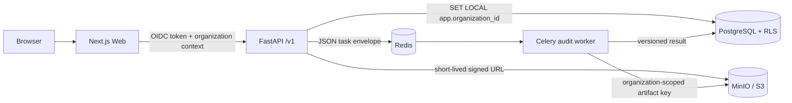
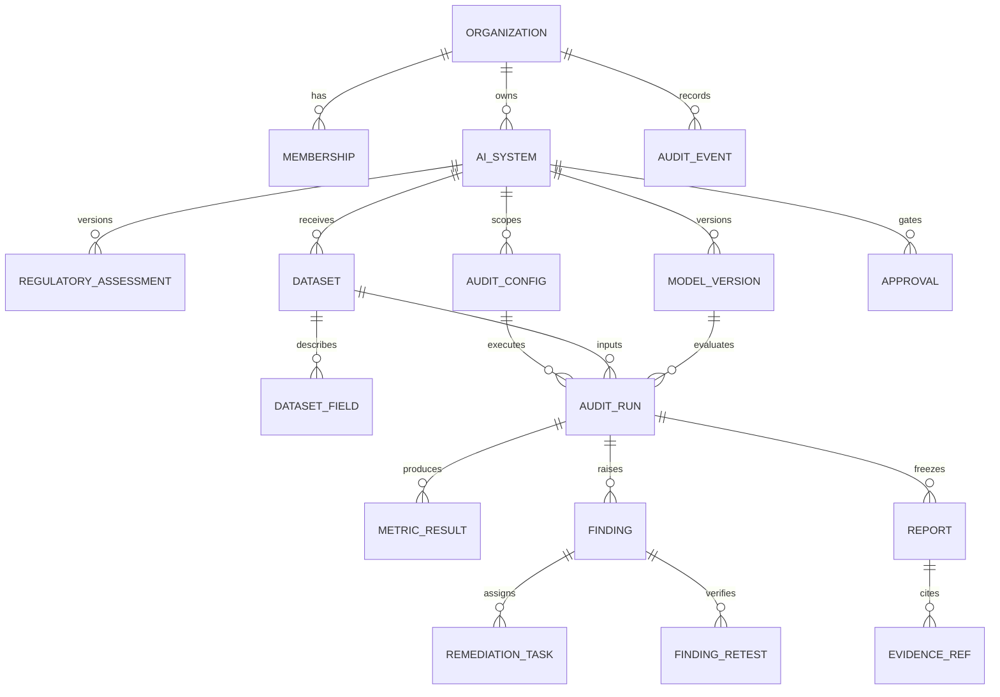

# Architecture and data model

## Runtime boundary

FairHire starts as a modular monolith plus an isolated analysis worker. The API owns authorization and transactional records. The worker receives immutable artifact references and identifiers; it never trusts tenant identity from a file payload.

Trust boundaries exist between browser/API, API/identity provider, API/object store, queue/worker, and tenant-scoped/attribute-vault data. Candidate identifiers and protected attributes are not placed in task names, URLs, logs or metrics labels.

## Core ERD

Entities scheduled after the foundation sprint are shown to keep keys and versioning decisions stable.

## Invariants

1. Every tenant business row contains `organization_id`; API predicates remain even where RLS is active.
2. `RegulatoryAssessment`, `AuditConfig`, `AuditRun`, `Approval` and `Report` are append-versioned. Published versions cannot be overwritten.
3. `MetricResult` stores value, confidence interval, raw counts, comparison groups, sample size, threshold source and computation version together.
4. Every audit run freezes dataset fingerprint, schema version, model version, config version, code commit, dependency digest and random seed.
5. Audit events cannot be updated or deleted through application SQL; entries form a hash chain.
6. Object keys start with `{organization_id}/audit-runs/{audit_run_id}/`; the worker validates this boundary again.

## Deployment decisions

- PostgreSQL 17, Redis 8 and S3-compatible MinIO are local-only dependencies in Compose. Production uses managed EU-region equivalents.
- API and worker are separate images and processes. Worker task serialization accepts JSON only.
- OIDC verification is an adapter behind `OIDCVerifier`; development header authentication is rejected by configuration in production.
- Large uploads do not pass through the API process. A later ingestion route issues short-lived, content-type constrained signed URLs.
