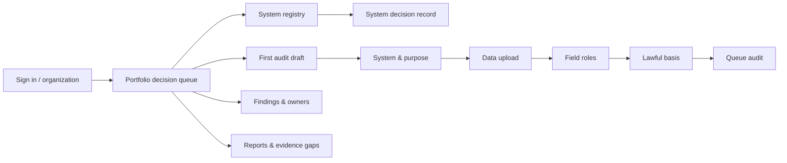

# Page flow, components and design tokens

## Product flow

The implemented Week 1–2 routes are `/login`, `/portfolio`, `/systems`, `/systems/[systemId]`, `/onboarding`, `/findings`, and `/reports`. Later workbench routes keep the information architecture in `DEVELOPMENT_PLAN.md`.

## Visual system

The semantic source of truth is `packages/ui/src/tokens.css`. Page CSS may only consume tokens; business status colors are never written directly in page components.

- `paper`: warm neutral working surface; `paper-raised` for controls, not generic cards.
- `ink`: green-tinted neutral scale for dense evidence reading.
- `green`: brand, approved states and primary action.
- `amber`: review or uncertain evidence, not a soft error.
- `red`: blocking or genuinely high-risk states only.
- `blue`: neutral draft/in-progress scheduling state.
- Type: editorial serif for decision-level headings and high-scan names; humanist sans for operational text; tabular numerals for metrics.
- Radius: 6/10/16px. Pills are reserved for compact status labels.
- Rhythm: rules and whitespace establish hierarchy; repeated nested cards are prohibited.

## Component inventory

| Component | Contract | Accessibility behavior |
|---|---|---|
| AppShell | Sidebar, top context, workspace, skip link | Visible focus, mobile drawer with scrim, current page announced |
| StatusBadge | approved/review/blocked/draft/insufficient | Visible text plus dot; never color-only |
| SeverityBadge | critical/high/medium/low | Text label available to assistive tech |
| Button | primary/secondary | 44px minimum; 48px for coarse pointer |
| SystemRegistry | typed systems, filter | Labeled search, empty-state recovery, mobile definition layout |
| PageIntro | eyebrow, title, lead, action | One page-level heading; action remains reachable on mobile |
| DataTable | planned shared primitive | Semantic table on desktop; labeled row cells on mobile |
| MetricLedger | planned shared primitive | Value, interval, counts, method, source and status together |
| EvidenceRef | planned shared primitive | Source version, fragment and retrieval time visible |
| Owner/DueDate | planned shared primitive | Human name and explicit calendar date; no avatar-only identity |
| Drawer/Dialog | exceptional use only | Focus trap, return focus, escape close, inert background |

## Content rules

- Say “Review required”, “Insufficient evidence” or “Needs legal confirmation”; never silently turn uncertainty into Pass.
- Thresholds are “risk signals from policy X version Y”, never legal verdicts.
- Every actionable risk keeps system, owner, due date, current state and evidence count nearby.
- Show when the API is offline and fixtures are displayed; fixture data must not look live.

